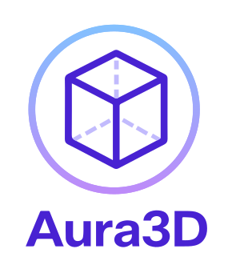
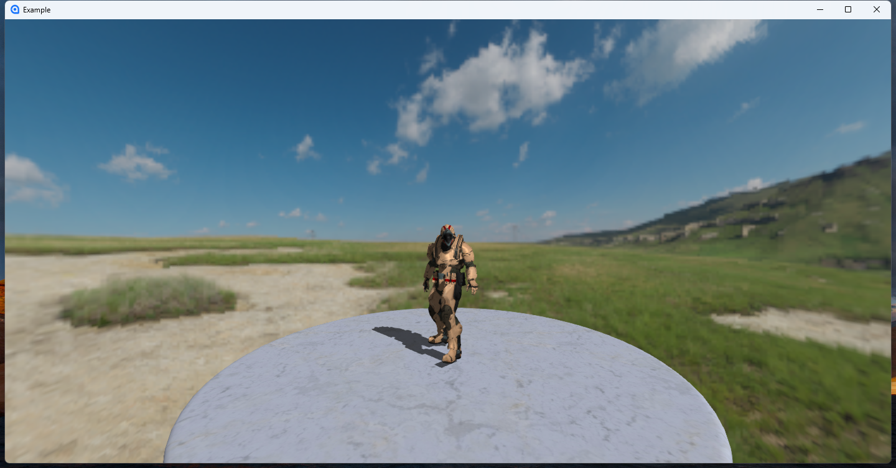

<div id="header" align="center">
    </img> 
    <h4><i>Aura3D is a lightweight, extensible, and high-performance 3D rendering control</i></h4>
    <div id="link">
        <span>English</span> | 
        <a href="./README_CN.md">中文</a> |
        <a href="./doc/en/home.md">Document</a> 
    </div>
</div>
<br/>



> [!IMPORTANT]
> The project is actively being developed, and we welcome all to submit suggestions generously.

## Features
### 1. Basic Functions
- Model Rendering
- Light
- Shadow
- Skeletal Animation
- Default Blinn-Phong Rendering Pipeline

### 2. Advanced Functions
- Custom Pipeline

### 3. Supported Platforms
- Avalonia

## Get Started

Add the Aura3D.Avalonia package to the Avalonia project:

```shell
dotnet add package Aura3D.Avalonia
```

Then use the Aura3DView control in your project and bind the SceneInitialized event:

```xaml
<Window
    ...
    xmlns:a="https://sunce.tech/aura3d"
    ...>
	<a:Aura3DView x:Name="aura3Dview" SceneInitialized="OnSceneInitialized"/>
</Window>
```

Initialize your scene in the SceneInitialized event:

```CSharp
 public void OnSceneInitialized(object sender, RoutedEventArgs args)
 {
	
    var view = (Aura3DView)sender;
    
    var camera = view.MainCamera;

    camera.ClearColor = Color.Gray;

	var model = ModelLoader.LoadGlbModel("your model file path(*.glb)");

	model.Position = camera.Forward * 3;

	view.AddNode(model);

 }
```
